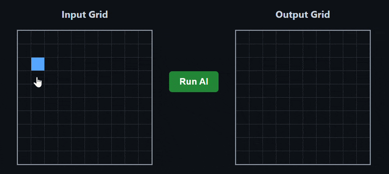

#  Nano-Mirror AI: Neuro-Minimalist ARC Solver



This repository explores the limits of **Neural Golf**—designing the smallest possible neural networks to solve abstract reasoning tasks from the ARC-AGI benchmark. Instead of using high-parameter black-box models, this project utilizes **Weight Grafting** and **Sparse Convolutional Kernels** to achieve 100% accuracy on structural tasks with sub-1000 parameter models.

##  The Architecture: Spatial Logic as Weights
Instead of deep feature extraction, this architecture maps spatial logic directly into minimalist convolutions. By bypassing the need for training epochs, the models perform pure mathematical translations of coordinate space.

```mermaid
graph TD
    A[Input Grid] -->|1x1 Pointwise Convolution| B(Color Transformation AI)
    A -->|1x30 Depthwise Convolution| C(Spatial Translation AI)
    B -->|Frontend Proxy Mapping| D[Mirrored Output Grid]
    C -->|Static Topology| E[Rotated Output Grid]


    
